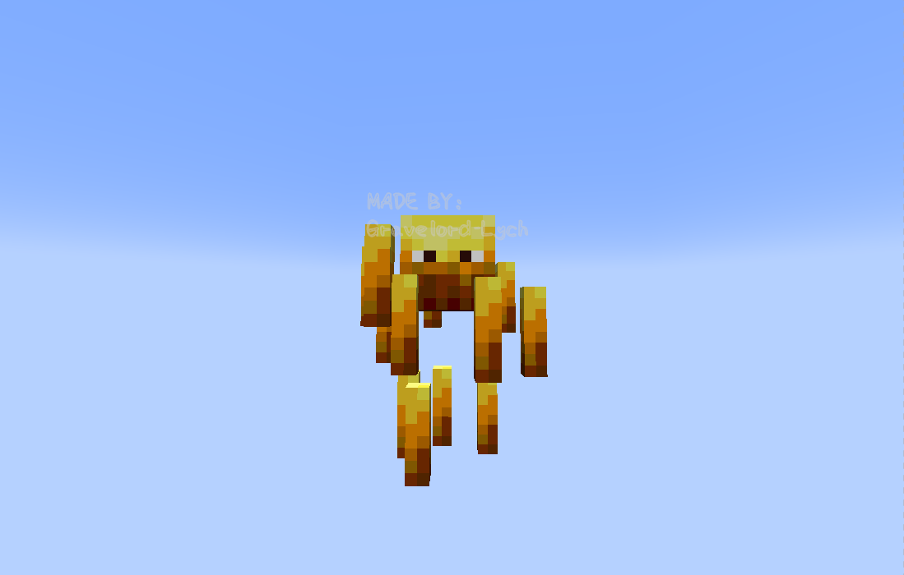
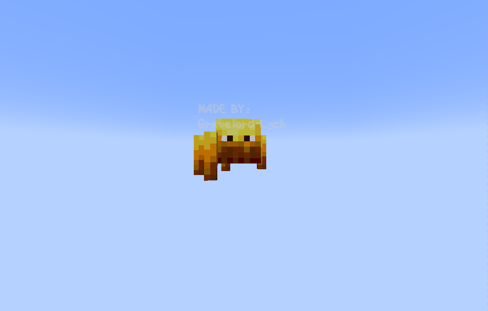
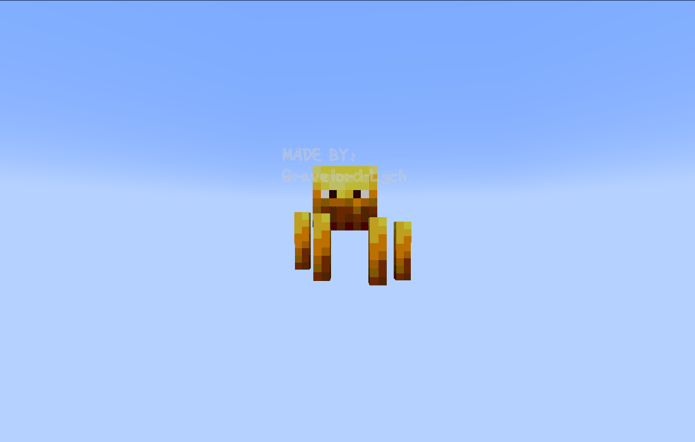
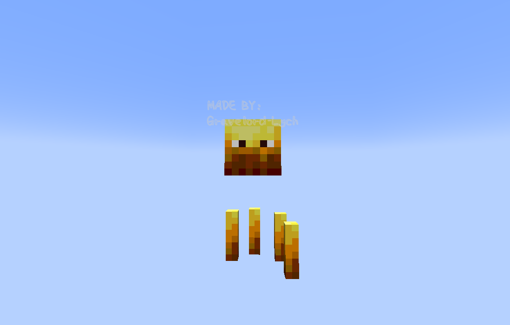

# 烈焰人身体结构的奥秘

烈焰人的身体由分为3层的，围绕一条轴旋转的“棒棒”构成。其中所有“棒棒”水平方向上绕轴做匀速圆周运动，竖直方向上做简谐运动，每层“棒棒”的运动又有一定的差异。  

叠加起来看是这样的（图中的烈焰人经过了特殊处理，不具有AI且身上没有黑烟），本文中所有动态图片都减速50%播放：


`BlazeModel`中的`setupAnim`方法实现了这个效果。我们对烈焰人逐“层”进行分析。`setupAnim`全部代码如下：  

```java
@Override
public void setupAnim(T blaze, float limbSwing, float limbSwingAmount, float ageInTicks, float netHeadYaw, float headPitch) {
    float rotation = ageInTicks * (float) Math.PI * -0.1F;
    for (int i = 0; i < 4; ++i) {
        upperBodyParts[i].y = -2.0F + Mth.cos(((float) (i * 2) + ageInTicks) * 0.25F);
        upperBodyParts[i].x = Mth.cos(rotation) * 9.0F;
        upperBodyParts[i].z = Mth.sin(rotation) * 9.0F;
        ++rotation;
    }

    rotation = ((float) Math.PI / 4F) + ageInTicks * (float)Math.PI * 0.03F;
    for (int j = 4; j < 8; ++j) {
        upperBodyParts[j].y = 2.0F + Mth.cos(((float) (j * 2) + ageInTicks) * 0.25F);
        upperBodyParts[j].x = Mth.cos(rotation) * 7.0F;
        upperBodyParts[j].z = Mth.sin(rotation) * 7.0F;
        ++rotation;
    }

    rotation = 0.47123894F + ageInTicks * (float) Math.PI * -0.05F; // 注：0.47123894 = Math.PI * 0.15
    for (int k = 8; k < 12; ++k) {
        upperBodyParts[k].y = 11.0F + Mth.cos(((float) k * 1.5F + ageInTicks) * 0.5F);
        upperBodyParts[k].x = Mth.cos(rotation) * 5.0F;
        upperBodyParts[k].z = Mth.sin(rotation) * 5.0F;
        ++rotation;
    }

    // 最后一部分调整了头部旋转，别忘了把角度转换成弧度
    head.yRot = netHeadYaw * ((float) Math.PI / 180F);
    head.xRot = headPitch * ((float) Math.PI / 180F);
}
```

每层“棒棒”竖直方向振动的振幅相等，而圆周运动的半径、角速度和竖直方向振动的频率满足下表（下表中所有数值为相对值）：

| “棒棒”所在层 | 圆周运动的半径 | 圆周运动的角速度 | 竖直方向振动的频率 |
|:------------:|:--------------:|:----------------:|:------------------:|
|     上层     |        9       |        -10       |          1         |
|     中层     |        7       |         3        |          1         |
|     下层     |        5       |        -5        |          2         |

先看上层“棒棒”：



```java
// 下面一行中，-0.1F为角速度
float rotation = ageInTicks * (float) Math.PI * -0.1F;
for (int i = 0; i < 4; ++i) {
    // 下面一行中，-2.0F为竖直方向的偏移量，i * 2 * 0.25F为初相，0.25F为（圆）频率
    upperBodyParts[i].y = -2.0F + Mth.cos(((float) (i * 2) + ageInTicks) * 0.25F);
    // 下面两行中，9.0F为角速度
    upperBodyParts[i].x = Mth.cos(rotation) * 9.0F;
    upperBodyParts[i].z = Mth.sin(rotation) * 9.0F;
    // 自增rotation改变了每根“棒棒”水平方向的初相
    ++rotation;
}
```
这里`rotation`变量最后乘上的系数决定了“棒棒”旋转的角速度，`upperBodyParts[i].x`，`upperBodyParts[i].z`最后乘上的系数决定了“棒棒”旋转的半径，而`upperBodyParts[i].y`的变化决定了“棒棒”竖直方向上做什么样的简谐运动。注意每根“棒棒”的初始位置（初相）不同，因此`rotation`在循环末尾会自增，且控制`upperBodyParts[i].y`变化的余弦函数加上了`i * 2`一项。  

然后看中层“棒棒”，注意中层“棒棒”与上下两层“棒棒”旋转方向相反：



```java
// 下面一行中，Math.PI / 4F为初相，0.03F为角速度
rotation = ((float) Math.PI / 4F) + ageInTicks * (float) Math.PI * 0.03F;
for (int j = 4; j < 8; ++j) {
    // 下面一行中，2.0F为竖直方向的偏移量，j * 2 * 0.25F为初相，0.25F为（圆）频率
    upperBodyParts[j].y = 2.0F + Mth.cos(((float) (j * 2) + ageInTicks) * 0.25F);
    // 下面两行中，7.0F为角速度
    upperBodyParts[j].x = Mth.cos(rotation) * 7.0F;
    upperBodyParts[j].z = Mth.sin(rotation) * 7.0F;
    ++rotation;
}
```

代码是大同小异的，因此就不额外解释了。  

还有下层“棒棒”：



```java
// 下面一行中，0.47123894F为初相，-0.05F为角速度
rotation = 0.47123894F + ageInTicks * (float) Math.PI * -0.05F; // 注：0.47123894 = Math.PI * 0.15
for (int k = 8; k < 12; ++k) {
    // 下面一行中，11.0F为竖直方向的偏移量，k * 1.5F * 0.5F为初相，0.5F为（圆）频率
    upperBodyParts[k].y = 11.0F + Mth.cos(((float) k * 1.5F + ageInTicks) * 0.5F);
    // 下面两行中，5.0F为角速度
    upperBodyParts[k].x = Mth.cos(rotation) * 5.0F;
    upperBodyParts[k].z = Mth.sin(rotation) * 5.0F;
    ++rotation;
}
```

在创建`LayerDefinition`的时候，我们给上文中`ageInTicks`变量赋值0，得到每根“棒棒”的初始状态。

```java
public static LayerDefinition createBodyLayer() {
    MeshDefinition meshDefinition = new MeshDefinition();
    PartDefinition partDefinition = meshDefinition.getRoot();
    partDefinition.addOrReplaceChild("head", CubeListBuilder.create().texOffs(0, 0).addBox(-4.0F, -4.0F, -4.0F, 8.0F, 8.0F, 8.0F), PartPose.ZERO);
    float rotation = 0.0F;
    CubeListBuilder builder = CubeListBuilder.create().texOffs(0, 16).addBox
    (0.0F, 0.0F, 0.0F, 2.0F, 8.0F, 2.0F);
    
    for (int i = 0; i < 4; ++i) {
        float x0 = Mth.cos(rotation) * 9.0F;
        float y0 = -2.0F + Mth.cos((float) (i * 2) * 0.25F);
        float z0 = Mth.sin(rotation) * 9.0F;
        partDefinition.addOrReplaceChild(getPartName(i), builder, PartPose.offset(x0, y0, z0));
        ++rotation;
    }
    
    rotation = ((float) Math.PI / 4F);
    for (int j = 4; j < 8; ++j) {
        float x0 = Mth.cos(rotation) * 7.0F;
        float y0 = 2.0F + Mth.cos((float) (j * 2) * 0.25F);
        float z0 = Mth.sin(rotation) * 7.0F;
        partDefinition.addOrReplaceChild(getPartName(j), builder, PartPose.offset(x0, y0, z0));
        ++rotation;
    }

    rotation = 0.47123894F;
    for(int k = 8; k < 12; ++k) {
        float x0 = Mth.cos(rotation) * 5.0F;
        float y0 = 11.0F + Mth.cos((float) k * 1.5F * 0.5F);
        float z0 = Mth.sin(rotation) * 5.0F;
        partDefinition.addOrReplaceChild(getPartName(k), builder, PartPose.offset(x0, y0, z0));
        ++rotation;
    }
    return LayerDefinition.create(meshDefinition, 64, 32);
}

private static String getPartName(int index) {
    return "part" + index;
}
```

构造方法中则初始化了`upperBodyParts`数组。  

```java
public BlazeModel(ModelPart root) {
    this.root = root;
    this.head = root.getChild("head");
    this.upperBodyParts = new ModelPart[12];
    Arrays.setAll(upperBodyParts, index -> root.getChild(getPartName(index)));
}
```

还有个问题是烈焰人为何可以一直保持明亮，其实这非常简单，只需要在`BlazeRenderer`中重写`getBlockLightLevel`方法，使其总是返回`15`就可以了：
```java
@Override
protected int getBlockLightLevel(Blaze blaze, BlockPos pos) {
    return 15;
}
```

`BlazeRenderer`中的其他代码同样很常规，这里也同样不放代码了。  

本节的内容差不多就是这些了，后面我们会开始分析唤魔者。