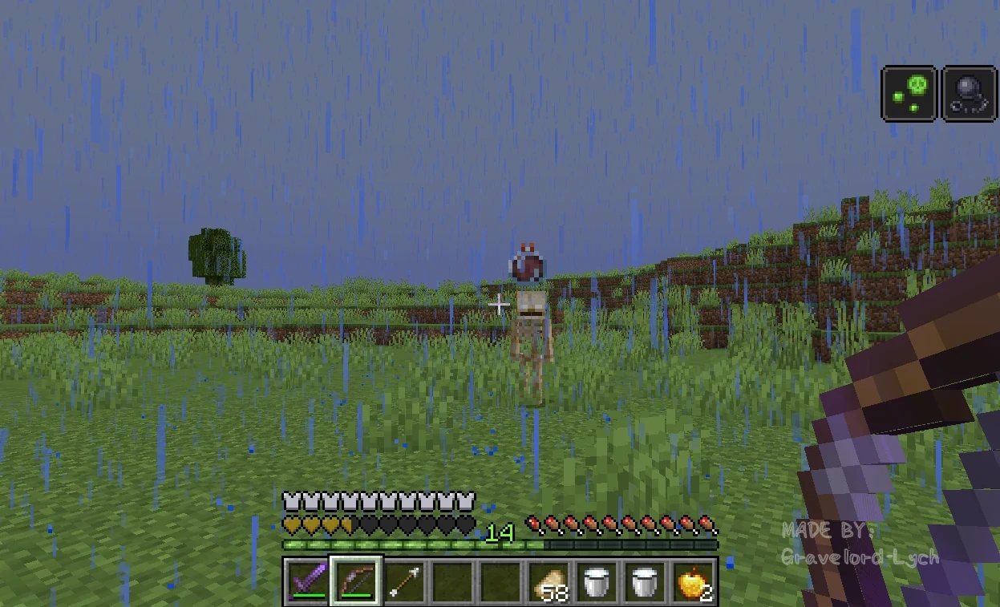
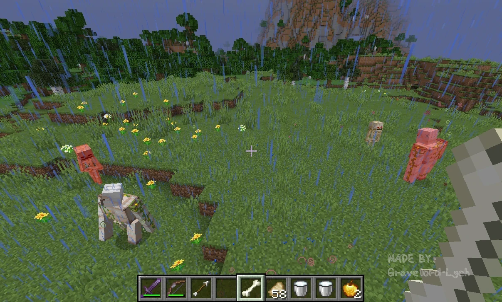

# 实战4 - 骷髅法师

我们已经有了女巫和骷髅，那么“杂交”女巫和骷髅可以得到什么新品种呢？

### 任务
**制作一种新的骷髅——骷髅法师**

---

### 要求
1. 骷髅法师的**生命值为100**，**护甲值为10**，**攻击力为3**，其余数值可以任意设置
2. 骷髅法师生成时**不携带任何装备**
3. 当骷髅法师的**生命值高于最大生命值的一半**时，骷髅法师会投掷喷溅药水进行攻击，具体攻击方式如下：
    1. 如果自身与攻击目标的**距离大于8**，同时目标**没有缓慢效果**，则**有50%的概率**选择**迟缓药水**
    2. 如果不满足i所述的条件，并且攻击目标生命值**大于等于攻击目标最大生命值的一半**，同时目标**不是亡灵生物**且**没有中毒效果**，则**一定**选择**剧毒药水**
    3. 如果不满足ii所述的条件，与攻击目标的**距离小于3**，同时目标**没有虚弱效果**，则**有25%的概率**选择**虚弱药水**。若攻击目标是**铁傀儡**，则这个概率增加到**100%**
    4. 如果上述条件都不满足，则选择**瞬间伤害**药水，攻击**亡灵生物**则使用**瞬间治疗**药水
4. 骷髅法师扔出的喷溅药水**有20%的概率**变为**滞留药水**，且**药水的药水效果不变**  
5. 当骷髅法师的**生命值不高于最大生命值的一半**时，骷髅法师**主手**会获得一把**力量II**附魔的**弓**，攻击方式变为**与普通骷髅相同**（注意该状态下移除武器后骷髅法师会进行近战攻击），同时**再也无法回到投掷药水的状态**
6. 骷髅法师是**亡灵生物**，且免疫**所有状态效果**
7. 骷髅法师**免疫来自自己的伤害**，对**有`DamageTypeTags.WITCH_RESISTANT_TO`标签的伤害**减免**85%**，受到来自**铁傀儡**的伤害**减半**
8. 骷髅法师可以被“强化”，具体细节如下：
    1. 强化骷髅法师的**生命值、护甲值和攻击力翻倍**
    2. 强化骷髅法师不再免疫**正面**状态效果，但依然免疫所有**负面**状态效果，不过保持免疫**中毒**和**生命恢复**效果不变。
    3. 强化骷髅法师**100%**扔出**二级药水**【对于**虚弱药水**，则扔出**虚弱药水（延长版）**，因为原版没有“虚弱药水 II”】，扔出**滞留药水**的概率增加到**30%**
    4. 强化骷髅法师的**眼睛**是**红色**的并且**亮度不受环境影响**，且眼睛**在强化骷髅法师本体隐身的条件下不可见**
    5. 当强化骷髅法师的生命值不高于最大生命值的一半时，骷髅法师主手获得的弓的附魔变为**力量V**，但强化骷髅法师**射击的速度与非强化的骷髅法师相同**
    6. 用骨头**右键**一个骷髅法师可以“强化”这个骷髅法师，这时骷髅法师的**四周会生成粒子效果**（粒子的种类任意），生命值会**被重置为最大生命值**，并**回到投掷药水的状态**（如果双手上有物品则会**把物品清除**）。**非创造模式下**“强化”一个骷髅法师还会**消耗一根骨头**。强化骷髅法师**无法再次被“强化”**
    7. 除以上要点所述内容外，强化骷髅法师的其他特性**与非强化的骷髅法师相同**
9. 骷髅法师**没有幼年状态**
10. 骷髅法师会像其他骷髅那样**主动攻击玩家、铁傀儡和幼年海龟**，**不攻击**时行为也**与骷髅完全相同**  
11. 骷髅法师**不会转化为流浪者**，也**不会掉落头颅**
12. 骷髅法师应该使用“骷髅”类型的材质（否则为什么叫**骷髅**法师(ง •_•)ง，当然这条不强求）
13. 非强化的骷髅法师的**眼睛不能是红色的**
14. 骷髅法师的音效可以任意设置

---

### 提示

- 这个实战所在的1.2.2.6节是非Boss级怪物中最重要（虽然不一定是最难）的前两章的最后一节，笔者想给这个实战略微上点难度，所以可能稍稍有一点复杂233

- 可以用`ItemStack`类中的`enchant`方法来附魔物品

- 想想骷髅法师的“强化”属性是不是用一个简单的`boolean`来表示就足够了……

- 要求8-vi需要老老实实地重写`mobInteract`方法来满足（~~别想找`Shearable`之类的捷径~~）

- 滞留药水没有单独的实体类，要想扔出滞留药水需要将`ThrownPotion`的物品设置为`Items.LINGERING_POTION`，就像这样：
```java
ThrownPotion thrownPotion = new ThrownPotion(level(), this);
thrownPotion.setItem(new ItemStack(Items.LINGERING_POTION));
```

- 要求9、10、11、14和某些要求中的一部分其实是在简化问题（）

---

### 参考步骤 \#1

要求8十分复杂，我们先不管这个要求。参考步骤#1部分中标`// TODO`的部分在后面实现要求8中的内容时都会进行修改。

依旧是先创建实体类`SkeletonWizard`。
```java
public class SkeletonWizard extends AbstractSkeleton {
    public SkeletonWizard(EntityType<? extends AbstractSkeleton> type, Level level) {
        super(type, level);
    }

    public static AttributeSupplier.Builder createAttributes() {
        return AbstractSkeleton.createAttributes()
                .add(Attributes.MAX_HEALTH, 100)
                .add(Attributes.ARMOR, 10)
                .add(Attributes.ATTACK_DAMAGE, 3);
    }
}
```

根据要求2，重写`populateDefaultEquipmentSlots`方法使骷髅法师不掉落任何物品。
```java
@Override
protected void populateDefaultEquipmentSlots(RandomSource random, DifficultyInstance difficultyInstance) {}
```

要求3~5描述了骷髅法师的攻击方式，我们不妨用一个`boolean`来记录骷髅法师的攻击状态。
```java
private static final String DOES_PHYSICAL_DAMAGE_TAG = "DoesPhysicalDamage";
private boolean doesPhysicalDamage;

public boolean doesPhysicalDamage() {
    return doesPhysicalDamage;
}

public void setDoesPhysicalDamage(boolean doesPhysicalDamage) {
    this.doesPhysicalDamage = doesPhysicalDamage;
}

// 不要把下面这一对儿给忘了~
@Override
public void addAdditionalSaveData(CompoundTag tag) {
    super.addAdditionalSaveData(tag);
    tag.putBoolean(DOES_PHYSICAL_DAMAGE_TAG, doesPhysicalDamage());
    // TODO
}

@Override
public void readAdditionalSaveData(CompoundTag tag) {
    // TODO
    super.readAdditionalSaveData(tag);
    setDoesPhysicalDamage(tag.getBoolean(DOES_PHYSICAL_DAMAGE_TAG));
    // TODO
}
```

对于要求3，可以使用嵌套的`if-else`语句来实现判断，但这里笔者选择创建一个叫做`PotionSelector`（药水选择器）的成员内部类，利用面向对象的编程方式来对骷髅法师应该使用的药水进行判断。   

将这个类声明为抽象类，并实现`Predicate`接口。这样每个`PotionSelector`的子类都可以`test`骷髅法师的攻击目标，检测通过了就选择这个子类对应的药水。

```java
private boolean shouldThrowLingeringPotion() {
    return random.nextDouble() < 0.2; // TODO
}

public abstract class PotionSelector implements Predicate<LivingEntity> {
    private final Potion potion;
    private final Potion strongerPotion; // 预留一个strongerPotion，表示强化骷髅法师应该扔出的药水，将来达到要求8的时候会用到
    
    public PotionSelector(Potion potion, Potion strongerPotion) {
        this.potion = potion;
        this.strongerPotion = strongerPotion;
    }

    public ThrownPotion getPotionProjectile() {
        ThrownPotion thrownPotion = new ThrownPotion(level(), SkeletonWizard.this);
        Item potionType = shouldThrowLingeringPotion() ? Items.LINGERING_POTION : Items.SPLASH_POTION;
        thrownPotion.setItem(PotionUtils.setPotion(new ItemStack(potionType), potion)); // TODO
        return thrownPotion;
    }
}
```

根据要求3-i到3-iv，依次创建5个子类。其中后2个子类用来处理要求3-iv。
```java
// 迟缓药水选择器
public class SlownessPotionSelector extends PotionSelector 
    public SlownessPotionSelector() {
        super(Potions.SLOWNESS, Potions.STRONG_SLOWNESS);
    }

    @Override
    public boolean test(LivingEntity target) {
        if (target.hasEffect(MobEffects.MOVEMENT_SLOWDOWN))
            return false;
        }
        // 这儿用random.nextBoolean()保证在其他条件都满足时扔出迟缓药水的概率为50%
        return distanceToSqr(target) > 8 * 8 && random.nextBoolean();
    }
}

// 剧毒药水选择器
public class PoisonPotionSelector extends PotionSelector {
    public PoisonPotionSelector() {
        super(Potions.POISON, Potions.STRONG_POISON);
    }

    @Override
    public boolean test(LivingEntity target) {
        if (target.getMobType() == MobType.UNDEAD) {
            return false;
        }
        if (target.hasEffect(MobEffects.POISON)) {
            return false;
        }
        return target.getHealth() >= target.getMaxHealth() * 0.5F;
    }
}

// 虚弱药水选择器
public class WeaknessPotionSelector extends PotionSelector {
    public WeaknessPotionSelector() {
        super(Potions.WEAKNESS, Potions.LONG_WEAKNESS);
    }

    @Override
    public boolean test(LivingEntity target) {
        if (target.hasEffect(MobEffects.WEAKNESS)) {
            return false;
        }
        if (distanceToSqr(target) >= 3 * 3) {
            return false;
        }
        // 对铁傀儡而言这一步后应该100%选用虚弱药水，所以先判断target是否是铁傀儡，如果是的话就直接返回true
        return target instanceof IronGolem || random.nextDouble() < 0.25;
    }
}

// 瞬间治疗药水选择器
public class HealingPotionSelector extends PotionSelector {
    public HealingPotionSelector() {
        super(Potions.HEALING, Potions.STRONG_HEALING);
    }

    @Override
    public boolean test(LivingEntity target) {
        return target.getMobType() == MobType.UNDEAD;
    }
}

// 瞬间伤害药水选择器
public class HarmingPotionSelector extends PotionSelector {
    public HarmingPotionSelector() {
        super(Potions.HARMING, Potions.STRONG_HARMING);
    }

    @Override
    public boolean test(LivingEntity target) {
        // 始终返回true，保证一定有药水可选
        return true;
    }
}
```
外部类中用一个列表存储所有的药水选择器。
```java
private final List<PotionSelector> potionSelectors = List.of(
        new SlownessPotionSelector(),
        new PoisonPotionSelector(),
        new WeaknessPotionSelector(),
        new HealingPotionSelector(),
        new HarmingPotionSelector()
);
```

写个`findPotion`方法，依次检查所有药水选择器，用来挑选合适的药水对付攻击目标。
```java
private ThrownPotion findPotion(LivingEntity target) {
    for (PotionSelector potionSelector : potionSelectors) {
        if (potionSelector.test(target)) {
            return potionSelector.getPotionProjectile();
        }
    }
    // 上面的步骤中保证了一定有一个PotionSelector（即HarmingPotionSelector）能够返回true，
    // 因此正常情况下不会抛出这个异常
    throw new IllegalStateException("No valid potion found");
}
```

再仿照女巫的`performRangedAttack`方法写一个投掷药水进行攻击的方法`preformPotionAttack`。
```java
private void preformPotionAttack(LivingEntity target) {
    Vec3 movement = target.getDeltaMovement();
    double x = target.getX() + movement.x - this.getX();
    double y = target.getEyeY() - 1.1 - this.getY();
    double z = target.getZ() + movement.z - this.getZ();
    double distance = Math.sqrt(x * x + z * z);
    ThrownPotion thrownPotion = findPotion(target);
    thrownPotion.setXRot(thrownPotion.getXRot() + 20.0F);
    thrownPotion.shoot(x, y + distance * 0.2, z, 0.75F, 8);
    if (!isSilent()) {
        // 这里的声音可以任意设置
        level().playSound(null, getX(), getY(), getZ(), SoundEvents.WITCH_THROW, getSoundSource(), 1.0F, 0.8F + random.nextFloat() * 0.4F);
    }
    level().addFreshEntity(thrownPotion);
}
```

然后重写`performRangedAttack`方法，根据骷髅法师攻击方式的不同选择不同的远程攻击方式。
```java
@Override
public void performRangedAttack(LivingEntity target, float power) {
    if (doesPhysicalDamage()) {
        super.performRangedAttack(target, power);
    } else {
        preformPotionAttack(target);
    }
}
```
这样就结束了吗？读者可以先思考一下上面的内容写完是否足够。  

答案是不够的。因为骷髅默认的远程攻击方式是射击，而不是投掷药水，毕竟一般的骷髅虽然聪明，却依然没有能力使用药水，因此我们需要第3个攻击类AI。还要记得重写`reassessWeaponGoal`方法，用于评估是否需要使用这个AI。由于这个方法在`AbstractSkeleton`的构造方法中被调用了，而且`AbstractSkeleton`类中的`bowGoal`和`meleeGoal`都是私有的，所以下面需要点小技巧。  
```java
private RangedAttackGoal potionAttackGoal;

// 注意reassessWeaponGoal方法在AbstractSkeleton的构造方法中就会被调用，如果将potionAttackGoal变为final的，
// 并在重写的reassessWeaponGoal方法中使用，就会因为potionAttackGoal未被初始化而抛出NPE。为了解决这个问题，笔
// 者额外创建了一个getPotionAttackGoal方法
private RangedAttackGoal getPotionAttackGoal() {
    if (potionAttackGoal == null) {
        potionAttackGoal = new RangedAttackGoal(this, 1, 60, 10);
    }
    return potionAttackGoal;
}

 @Override
 public void reassessWeaponGoal() {
     if (!level().isClientSide()) {
         removeMeleeGoalAndBowGoal();
         goalSelector.removeGoal(getPotionAttackGoal());
         if (doesPhysicalDamage()) {
             super.reassessWeaponGoal();
         } else {
             goalSelector.addGoal(4, getPotionAttackGoal());
         }
     }
 }

// 这个方法用来移除`AbstractSkeleton`类中的`bowGoal`和`meleeGoal`，防止骷髅法师同时有两个攻击类AI起效。
// 查阅GoalSelector中的方法可知，getAvailableGoals方法可以拿到所有的AI，又因为AbstractSkeleton中有且只有bowGoal继承了
// RangedBowAttackGoal类，加上有且只有meleeGoal继承了MeleeAttackGoal，所以我们只需移除所有MeleeAttackGoal的实例及所有
// RangedBowAttackGoal的实例即可
private void removeMeleeGoalAndBowGoal() {
    goalSelector.getAvailableGoals().stream()
            .filter(SkeletonWizard::isMeleeGoalOrBowGoal)
            .filter(WrappedGoal::isRunning)
            .forEach(WrappedGoal::stop);
    goalSelector.getAvailableGoals().removeIf(SkeletonWizard::isMeleeGoalOrBowGoal);
}

private static boolean isMeleeGoalOrBowGoal(WrappedGoal wrappedGoal) {
    return wrappedGoal.getGoal() instanceof MeleeAttackGoal || wrappedGoal.getGoal() instanceof RangedBowAttackGoal<?>;
}
```

还有`readAdditionalSaveData`方法需要调整。
```java
@Override
public void readAdditionalSaveData(CompoundTag tag) {
    // TODO
    super.readAdditionalSaveData(tag);
    setDoesPhysicalDamage(tag.getBoolean(DOES_PHYSICAL_DAMAGE_TAG));
    // 这里必须重新重评估攻击类AI，因为骷髅法师的攻击方式发生了变化
    reassessWeaponGoal();
}
```
因为`readAdditionalSaveData`方法中读取了`doesPhysicalDamage`的值，这会影响骷髅法师的攻击方式，因此在`readAddtionalSaveData`方法最后加上`reassessWeaponGoal`，来再次评估应该使用的攻击类AI。  

最后重写`aiStep`方法，实现对骷髅法师生命值的实时判断，以实时准备更新骷髅法师的状态。
```java
@Override
public void aiStep() {
    super.aiStep();
    if (getHealth() <= getMaxHealth() * 0.5F && !doesPhysicalDamage()) {
        setDoesPhysicalDamage(true);
        awardBow();
    }
}

private void awardBow() {
    ItemStack bow = new ItemStack(Items.BOW);
    bow.enchant(Enchantments.POWER_ARROWS, 2); // TODO
    setItemInHand(InteractionHand.MAIN_HAND, bow);
}
```
这样要求3~5就基本达到了。下面来看要求6，骷髅本身就是亡灵生物，所以不需要重写`getMobType`方法，但是仍然需要重写`canBeAffected`方法。
```java
@Override
public boolean canBeAffected(MobEffectInstance instance) {
    return false; // TODO
}
```
这里直接返回了`false`，稍后达到要求8时会修改这里的返回值。  

仿照女巫的减伤方式，重写`getDamageAfterMagicAbsorb`方法来达到要求7。
```java
@Override
protected float getDamageAfterMagicAbsorb(DamageSource source, float amount) {
    amount = super.getDamageAfterMagicAbsorb(source, amount);
    if (source.getEntity() == this) {
        amount = 0;
    }
    if (source.getEntity() instanceof IronGolem) {
        amount *= 0.5F;
    }
    if (source.is(DamageTypeTags.WITCH_RESISTANT_TO)) {
        amount *= 0.15F;
    }
    return amount;
}
```

要求9很容易达到。而对于要求10、11的话，其实`AbstractSkeleton`类定义的默认行为就已经可以满足这两个要求了，所以不需要特殊处理这两个要求。
```java
@Override
public boolean isBaby() {
    return false;
}

@Override
public void setBaby(boolean baby) {}
```

最后添加一部分声音。
```java
@Override
protected SoundEvent getStepSound() {
    return SoundEvents.SKELETON_STEP;
}

@Override
protected SoundEvent getAmbientSound() {
    return SoundEvents.SKELETON_AMBIENT;
}

@Override
protected SoundEvent getHurtSound(DamageSource source) {
    return SoundEvents.SKELETON_HURT;
}

@Override
protected SoundEvent getDeathSound() {
    return SoundEvents.SKELETON_DEATH;
}
```

渲染类`SkeletonWizardRenderer`非常普通，但后面会在里面加点内容。
```java
public class SkeletonWizardRenderer extends SkeletonRenderer {
    private static final ResourceLocation SKELETON_WIZARD = Utils.prefix("textures/entity/skeleton_wizard/skeleton_wizard.png");

    public SkeletonWizardRenderer(EntityRendererProvider.Context context) {
        super(context,
                ModModelLayers.SKELETON_WIZARD,
                ModModelLayers.SKELETON_WIZARD_INNER_ARMOR,
                ModModelLayers.SKELETON_WIZARD_OUTER_ARMOR);
        // TODO
    }

    @Override
    public ResourceLocation getTextureLocation(AbstractSkeleton skeleton) {
        return SKELETON_WIZARD;
    }
}
```

注册部分仍然没展示，但千万不要把它们漏了！！！  

到此为止如果一切顺利的话，只要骷髅法师的材质合适，我们应该就已经得到了一个满足除要求8外所有要求的骷髅法师了。

---

### 参考步骤 \#2

下面正式开始“对付”要求8。还记得“提示”部分中留的那个小思考题吗？因为涉及到红色眼睛的渲染问题，所以**只用一个`boolean`是不够的**。我们需要借助`SynchedEntityData`。
```java
private static final EntityDataAccessor<Boolean> REINFORCED = SynchedEntityData.defineId(SkeletonWizard.class, EntityDataSerializers.BOOLEAN);
private static final String REINFORCED_TAG = "Reinforced";

@Override
protected void defineSynchedData() {
    super.defineSynchedData();
    entityData.define(REINFORCED, false);
}

public boolean isReinforced() {
    return entityData.get(REINFORCED);
}
```
为达到要求8-i，新增1个`AttributeModifier`用于加倍骷髅法师的一些属性。同时我们对`setReinforced`方法做些小修改，使在设置骷髅法师是否被强化的同时能够更新骷髅法师的属性。
```java
private static final UUID REINFORCED_BONUS_UUID = UUID.fromString("0153B2B3-CC49-470F-AD1C-B8D31EFAD17D");
private static final AttributeModifier REINFORCED_BONUS = new AttributeModifier(REINFORCED_BONUS_UUID, "Reinforced bonus", 1, AttributeModifier.Operation.MULTIPLY_TOTAL);

public void setReinforced(boolean reinforced, boolean update) {
    entityData.set(REINFORCED, reinforced);
    if (!level().isClientSide()) {
        if (reinforced) {
            Objects.requireNonNull(getAttribute(Attributes.MAX_HEALTH)).addTransientModifier(REINFORCED_BONUS);
            Objects.requireNonNull(getAttribute(Attributes.ARMOR)).addTransientModifier(REINFORCED_BONUS);
            Objects.requireNonNull(getAttribute(Attributes.ATTACK_DAMAGE)).addTransientModifier(REINFORCED_BONUS);
            if (update) {
                resetItemsInHands(); // 把双手的物品清除
                setHealth(getMaxHealth()); // 注意调整最大生命值后要让实体具有新的最大生命值，需要setHealth(getMaxHealth())
                setDoesPhysicalDamage(false); // 回到用药水攻击的状态
                reassessWeaponGoal(); // 重新评估攻击类AI
            }
        } else {
            Objects.requireNonNull(getAttribute(Attributes.MAX_HEALTH)).removeModifier(REINFORCED_BONUS);
            Objects.requireNonNull(getAttribute(Attributes.ARMOR)).removeModifier(REINFORCED_BONUS);
            Objects.requireNonNull(getAttribute(Attributes.ATTACK_DAMAGE)).removeModifier(REINFORCED_BONUS);
        }
    }
}
```
当`update`为`true`时，表示重置骷髅法师的一些数据，来实现要求8-vi中的一部分内容。当`update`为`false`时，只会更新骷髅法师的属性。  

要完全达到要求8-vi，还需要重写`mobInteract`方法。
```java
@Override
public InteractionResult mobInteract(Player player, InteractionHand hand) {
    ItemStack stack = player.getItemInHand(hand);
    if (level().isClientSide()) {
        boolean canBeReinforced = stack.is(Items.BONE) && !isReinforced();
        if (canBeReinforced) {
            // 这里用了刷怪笼刷出怪物时在怪物的位置生成的粒子效果，另外这个方法只有在客户端调用才会起效果
            spawnAnim();
        }
        // mobInteract方法在客户端的返回值会影响玩家到是否会摆动手臂（SUCCESS和CONSUME都使玩家摆动手臂）
        return canBeReinforced ? InteractionResult.CONSUME : InteractionResult.PASS;
    } else if (stack.is(Items.BONE)) {
        if (!player.getAbilities().instabuild) {
            stack.shrink(1);
        }
        if (!isReinforced()) {
            setReinforced(true, true);
        }
        return InteractionResult.SUCCESS;
    } else {
        return super.mobInteract(player, hand);
    }
}
```

数据保存的部分也要再次随之调整。
```java
@Override
public void addAdditionalSaveData(CompoundTag tag) {
    super.addAdditionalSaveData(tag);
    tag.putBoolean(DOES_PHYSICAL_DAMAGE_TAG, doesPhysicalDamage());
    tag.putBoolean(REINFORCED_TAG, isReinforced());
}

@Override
public void readAdditionalSaveData(CompoundTag tag) {
    // 这个方法必须放在super.readAdditionalSaveData(tag)前，否则强化骷髅法师的生命值会加载出错（加载为min(正确的生命值, 100)）
    setReinforced(tag.getBoolean(REINFORCED_TAG), false);
    super.readAdditionalSaveData(tag);
    setDoesPhysicalDamage(tag.getBoolean(DOES_PHYSICAL_DAMAGE_TAG));
}
```

接着根据要求8-iii中的内容修改药水投掷部分的内容。
```java
private boolean shouldThrowLingeringPotion() {
    return random.nextDouble() < (isReinforced() ? 0.3 : 0.2);
}
```
`PotionSelector`：
```java
public ThrownPotion getPotionProjectile() {
    ThrownPotion thrownPotion = new ThrownPotion(level(), SkeletonWizard.this);
    Item potionType = shouldThrowLingeringPotion() ? Items.LINGERING_POTION : Items.SPLASH_POTION;
    thrownPotion.setItem(PotionUtils.setPotion(new ItemStack(potionType), isReinforced() ? strongerPotion : potion));
    return thrownPotion;
}
```

此外，根据要求8-ii、8-v，`canBeAffected`和`awardBow`方法也有修改。
```java
@Override
public boolean canBeAffected(MobEffectInstance instance) {
    MobEffect effect = instance.getEffect();
     // 原本就可以免疫的状态效果现在也一定是可以免疫的
    if (!super.canBeAffected(instance)) {
        return false;
    }
    return effect.isBeneficial() && isReinforced();
}

private void awardBow() {
    ItemStack bow = new ItemStack(Items.BOW);
    bow.enchant(Enchantments.POWER_ARROWS, isReinforced() ? 5 : 2);
    setItemInHand(InteractionHand.MAIN_HAND, bow);
}
```

最后只剩下要求8-iv需要特殊处理了。由于骷髅法师的“红色眼睛”与末影人、蜘蛛等的眼睛不太相同，并且是否显示红眼与骷髅法师的自身状态有关，所以不能直接继承`EyesLayer`。
```java
public class SkeletonWizardEyesLayer extends RenderLayer<AbstractSkeleton, SkeletonModel<AbstractSkeleton>> {
    private static final ResourceLocation SKELETON_WIZARD_EYES = Utils.prefix("textures/entity/skeleton_wizard/skeleton_wizard_eyes.png");
    private static final RenderType SKELETON_WIZARD_EYES_RENDER_TYPE = RenderType.entityCutoutNoCull(SKELETON_WIZARD_EYES);

    public SkeletonWizardEyesLayer(RenderLayerParent<AbstractSkeleton, SkeletonModel<AbstractSkeleton>> parent) {
        super(parent);
    }

    @Override
    public void render(PoseStack poseStack, MultiBufferSource source, int packedLight, AbstractSkeleton skeleton, float limbSwing, float limbSwingAmount, float partialTicks, float ageInTicks, float netHeadYaw, float headPitch) {
        // SkeletonWizard直接使用了骷髅的通用模型，因此只能在这里额外进行类型判断了……
        if (!(skeleton instanceof SkeletonWizard wizard)) {
            throw new IllegalArgumentException("SkeletonWizardEyesLayer can only render SkeletonWizard, found: " + skeleton.getClass().getSimpleName());
        }
        if (wizard.isReinforced() && !wizard.isInvisible()) {
            VertexConsumer consumer = source.getBuffer(SKELETON_WIZARD_EYES_RENDER_TYPE);
            getParentModel().renderToBuffer(poseStack, consumer, 15728640, OverlayTexture.NO_OVERLAY, 1, 1, 1, 1);
        }
    }
}
```
在`SkeletonWizardRenderer`的构造方法中添加这个`Layer`。

```java
public SkeletonWizardRenderer(EntityRendererProvider.Context context) {
    super(context,
            ModModelLayers.SKELETON_WIZARD,
            ModModelLayers.SKELETON_WIZARD_INNER_ARMOR,
            ModModelLayers.SKELETON_WIZARD_OUTER_ARMOR);
    addLayer(new SkeletonWizardEyesLayer(this));
}
```

这样我们的“杂交实验”就成功完成了。虽然这个实体看似非常复杂，但实际上任何一个Boss级生物都可能比这个实体复杂得多，而且制作这个实体所真正涉及的知识点并不多（例如自定义弹射物都没用上）。尽管如此，如果读者能够在阅读该教程的最前一部分后，独立制作出这种复杂程度的实体，那么笔者还是会为此而感到欣慰的，因为这让笔者知道了自己的努力没有白费。  

1.2的内容到此已经过去一大半了，接下来的1.2.3与1.2.4不是特别重要，可能篇幅短一些。

[源代码（`SkeletonWizard`类）](https://github.com/Gravelord-Lych/polonium-ExampleMod/blob/main/src/main/java/lych/polonium/entity/monster/SkeletonWizard.java)  
[源代码（`SkeletonWizardRenderer`类）](https://github.com/Gravelord-Lych/polonium-ExampleMod/blob/main/src/main/java/lych/polonium/client/renderer/SkeletonWizardRenderer.java)  
[源代码（`SkeletonWizardEyesLayer`类）](https://github.com/Gravelord-Lych/polonium-ExampleMod/blob/main/src/main/java/lych/polonium/client/layer/SkeletonWizardEyesLayer.java)

---

### 效果图（非强化的骷髅法师使用了白眼、黄棕色躯体的骷髅的材质）
*1个非强化的骷髅法师向玩家投掷滞留型瞬间伤害药水*

*2个强化骷髅法师与2个铁傀儡激烈交战*


---

### 思考与练习  
- 在笔者试图让强化骷髅法师与铁傀儡1v1作战时，发现**用弓箭射击的阶段是强化骷髅法师的短板**，因此能否使**骷髅法师的射箭频率比一般的骷髅高**，且**强化骷髅法师射击地更快**？
- 能否让骷髅法师**每次在生命值恢复至超过一半时**，都**重新获得投掷药水的能力**（就像Java版中凋灵生命值恢复至超过一半时凋灵护甲自动消失那样）？
- 能否让骷髅法师在**投掷药水前**，手上**展示将要投掷出的药水种类**？
- 能否让骷髅法师在生命值**第一次**降低至**不高于最大生命值的一半时**，在四周**合适**的位置召唤**几个骷髅**协助自己作战？
