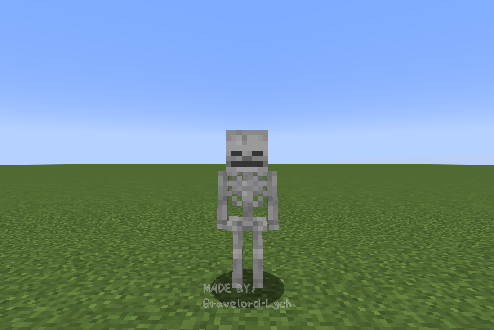
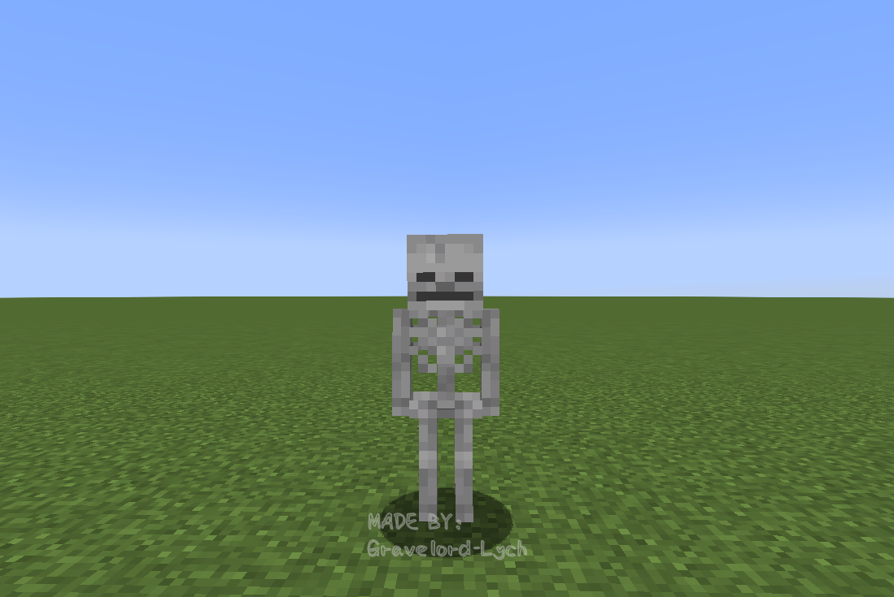
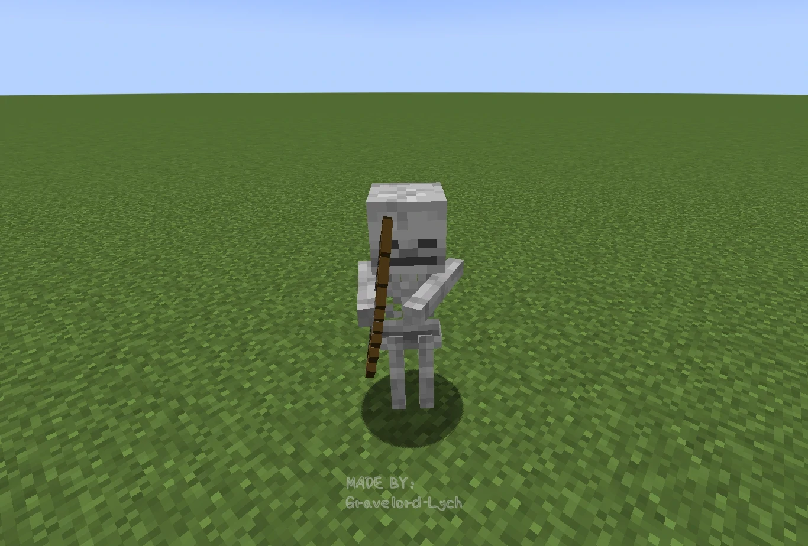
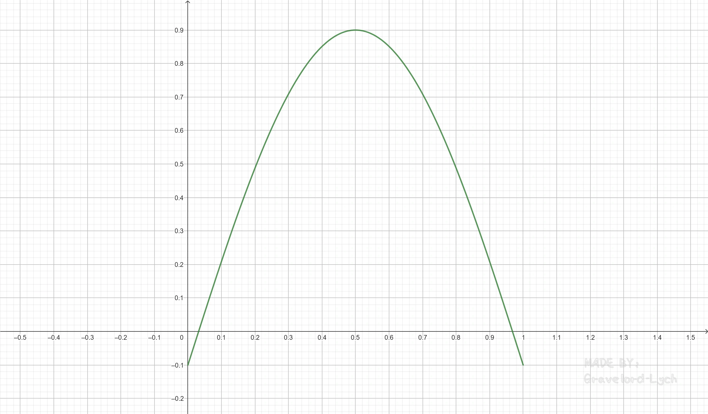
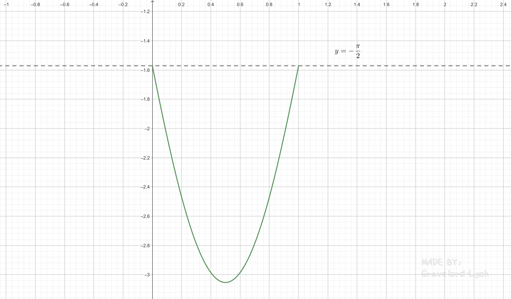

#骷髅的模型（与渲染）

*注：*  

*之前讲末影人的模型的时候曾经提到过`xRot`，`yRot`和`zRot`，但`EndermanModel`中对这三个变量的运用比较简单，所以没有细讲。本节中可能会涉及到更加复杂的旋转角度调节，如果读者对`ModelPart`绕x、y、z轴的旋转不够熟悉，下面斜体的内容可能会有所帮助。*

*`ModelPart`中`xRot`，`yRot`，`zRot`分别表示绕**`ModelPart`的相对坐标系**的x、y、z轴旋转的**弧度**。以下三张图分别展示了骷髅头部绕x、y、z轴**正向**（指当`xRot`/`yRot`/`zRot`值增大时的旋转方向）旋转的效果。（图中的骷髅经过了特殊处理，不具有AI、装备且不会在阳光下燃烧）*  

*x轴：*


*y轴：*


*z轴：*


我们先来探讨一下要想制作骷髅的模型，除了一些实体模型共有的东西以外，还需要什么。  

容易发现，骷髅会使用弓箭，因此要对此做特殊处理。在`SkeletonModel`中，有如下的代码。
```java
@Override
public void prepareMobModel(T skeleton, float limbSwing, float limbSwingAmount, float partialTicks) {
    rightArmPose = HumanoidModel.ArmPose.EMPTY;
    leftArmPose = HumanoidModel.ArmPose.EMPTY;
    ItemStack stack = skeleton.getItemInHand(InteractionHand.MAIN_HAND);
    if (stack.is(Items.BOW) && skeleton.isAggressive()) {
        if (skeleton.getMainArm() == HumanoidArm.RIGHT) {
            rightArmPose = HumanoidModel.ArmPose.BOW_AND_ARROW;
        } else {
            leftArmPose = HumanoidModel.ArmPose.BOW_AND_ARROW;
        }
    }
    super.prepareMobModel(skeleton, limbSwing, limbSwingAmount, partialTicks);
}
```
这部分内容判断了骷髅是否在用弓箭攻击，如果是，则调整手臂的姿势为`ArmPose.BOW_AND_ARROW`。那如果姿势为`ArmPose.BOW_AND_ARROW`的时候，手臂的旋转又是怎样被处理的呢？

这就要看父类`HumanoidModel`中的`poseRightArm`和`poseLeftArm`方法在手臂姿势为`ArmPose.BOW_AND_ARROW`时的特有处理方式了。   

`poseRightArm`：
```java
rightArm.yRot = -0.1F + head.yRot;
leftArm.yRot = 0.1F + head.yRot + 0.4F;
rightArm.xRot = (-(float) Math.PI / 2F) + head.xRot;
leftArm.xRot = (-(float) Math.PI / 2F) + head.xRot;
```

`poseLeftArm`：
```java
rightArm.yRot = -0.1F + head.yRot - 0.4F;
leftArm.yRot = 0.1F + head.yRot;
// 下面这两行和poseRightArm相同
rightArm.xRot = (-(float) Math.PI / 2F) + head.xRot;
leftArm.xRot = (-(float) Math.PI / 2F) + head.xRot;
```

这两个方法中都将两只手臂抬高了90°，且又加上了一个`head.xRot`来确保手臂随头部抬高而抬高。在`yRot`的调节上，两个方法的处理则是互相“对称”的。当“右撇子”的骷髅射箭时，显然左臂的偏移角度应该大一些，所以`leftArm.yRot`额外向内旋转了0.4弧度，而当“左撇子”的骷髅射箭时则正好相反。下图展示了一个“右撇子”骷髅手持弓进行攻击时的姿势（图中的骷髅经过了特殊处理，不会在阳光下燃烧）  

**“右撇子”骷髅手持弓进行攻击，可以很明显地发现它的左臂的旋转幅度更大**


前面说过骷髅是一种既能远程攻击又能近战的生物，那么骷髅近战的时候手臂又是如何处理的呢？我们可以在`setupAnim`中找到答案。
```java
@Override
public void setupAnim(T skeleton, float limbSwing, float limbSwingAmount, float ageInTicks, float netHeadYaw, float headPitch) {
    super.setupAnim(skeleton, limbSwing, limbSwingAmount, ageInTicks, netHeadYaw, headPitch);
    ItemStack mainHandItem = skeleton.getMainHandItem();
    if (skeleton.isAggressive() && (mainHandItem.isEmpty() || !mainHandItem.is(Items.BOW))) {
        // attackTime的计算方式：已经摆动（swing）手臂的时长/摆动手臂的总时长
        // 注意attackTime在摆动手臂时才取非零（介于0~1间且不取1）的值，因此在骷髅未摆动手臂进行攻击时以下两个局部变量的值均为0
        float f = Mth.sin(attackTime * (float) Math.PI);
        float f1 = Mth.sin((1.0F - (1.0F - attackTime) * (-attackTime)) * (float) Math.PI);
        // 重置了zRot的值
        rightArm.zRot = 0.0F;
        leftArm.zRot = 0.0F;
        // 在发动近战攻击时，让手臂沿y轴小幅转动
        rightArm.yRot = -(0.1F - f * 0.6F);
        leftArm.yRot = 0.1F - f * 0.6F;
        // 将手臂抬起90°
        rightArm.xRot = -(float) Math.PI / 2F;
        leftArm.xRot = -(float) Math.PI / 2F;
        // 在发动近战攻击时，将手臂抬得更高
        rightArm.xRot -= f * 1.2F - f1 * 0.4F;
        leftArm.xRot -= f * 1.2F - f1 * 0.4F;
        // 该方法用于给手臂沿x、z轴添加规律的小幅摆动，使手臂更加自然
        AnimationUtils.bobArms(rightArm, leftArm, ageInTicks);
    }
}
```
附上`rightArm.yRot`和`rightArm.xRot`随`attackTime`变化的图象。  

`rightArm.yRot`-`attackTime`图象：

`rightArm.xRot`-`attackTime`图象：


骷髅的手臂较细，所以`SkeletonModel`中还重写了`translateToHand`方法，给了骷髅拿在手上的东西一个小小的向内的位置偏移。
```java
@Override
public void translateToHand(HumanoidArm arm, PoseStack stack) {
    float offset = arm == HumanoidArm.RIGHT ? 1.0F : -1.0F;
    ModelPart part = getArm(arm);
    part.x += offset;
    part.translateAndRotate(stack);
    part.x -= offset;
}
```

骷髅的渲染类`SkeletonRenderer`没有什么重要的地方，而且基本上与僵尸是一致的，这里就不放代码了。  

本节的内容就是这些了哦，下一节将会再讲一个实战。